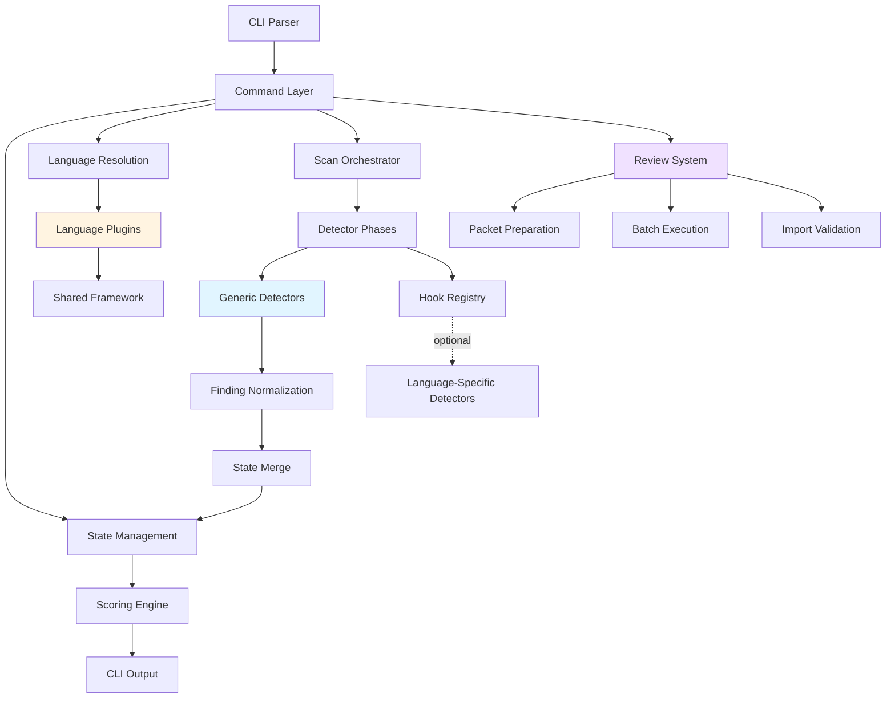
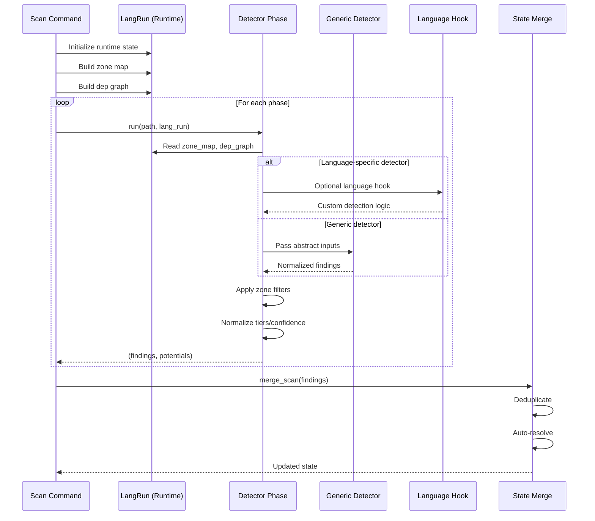
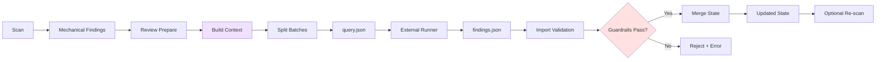

## Overview

Desloppify is a **plugin-based multi-language quality scanner** with strict architectural boundaries. The system separates language-agnostic detection algorithms from language-specific parsers, and isolates LLM review coordination from the core scan pipeline.

**Core design principles**:

1. **Language plugins as first-class modules** — each language is self-contained
2. **Generic detectors with zero language knowledge** — algorithms work on abstract inputs
3. **Fail-closed import validation** — invalid data doesn't corrupt state
4. **Immutable config, mutable runtime** — `LangConfig` is static, `LangRun` holds scan state
5. **Import direction discipline** — `languages/` → `engine/`, never reversed

## High-Level Architecture



## Module Structure

### Core Modules

```
desloppify/
├── app/                      # CLI command layer
│   ├── cli_support/          # Argument parsing
│   └── commands/             # Command implementations
│       ├── scan/             # Scan workflow
│       ├── review/           # Review workflow
│       ├── fix/              # Auto-fix workflow
│       └── helpers/          # Shared command utilities
│
├── core/                     # Core infrastructure
│   ├── discovery_api.py      # File discovery
│   ├── output_api.py         # Terminal output
│   ├── config.py             # Project config (.desloppify/config.json)
│   └── runtime_state.py      # Per-command runtime context
│
├── state.py                  # State persistence (findings, scores, assessments)
├── engine/                   # Generic detection algorithms
│   ├── detectors/            # Language-agnostic detectors
│   │   ├── base.py
│   │   ├── complexity.py
│   │   ├── coupling.py
│   │   ├── dupes.py
│   │   ├── gods.py
│   │   ├── large.py
│   │   ├── naming.py
│   │   ├── orphaned.py
│   │   └── review_coverage.py
│   ├── policy/
│   │   └── zones.py          # Zone classification
│   └── _state/               # State merge rules
│
├── languages/                # Language plugin system
│   ├── _framework/           # Shared plugin framework
│   │   ├── base/             # Core contracts (LangConfig, DetectorPhase)
│   │   ├── treesitter/       # Tree-sitter integration
│   │   ├── runtime.py        # LangRun (mutable scan state)
│   │   ├── resolution.py     # Plugin discovery
│   │   └── generic.py        # Generic plugin factory
│   ├── typescript/           # Full TypeScript plugin
│   ├── python/               # Full Python plugin
│   ├── csharp/               # Full C# plugin
│   ├── rust/                 # Generic Rust plugin
│   └── ...
│
├── intelligence/             # LLM-powered analysis
│   ├── review/               # Subjective review system
│   │   ├── context.py        # Context building
│   │   ├── prepare.py        # Packet generation
│   │   ├── dimensions/       # Review dimensions
│   │   └── importing/        # Import validation
│   ├── narrative/            # Agent guidance
│   └── integrity.py          # Score consistency checks
│
├── scoring.py                # Scoring algorithms
└── hook_registry.py          # Optional language hooks
```

### Import Direction Rules

**Allowed**:
- `languages/<name>/` → `engine/detectors/`
- `languages/<name>/` → `languages/_framework/`
- `app/commands/` → `intelligence/`
- `app/commands/` → `engine/`

**Forbidden**:
- `engine/` → `languages/` (generic code can't depend on language plugins)
- `languages/_framework/` → `languages/<name>/` (framework can't import plugins)
- Circular dependencies between plugins

**Validation**: `pytest desloppify/tests/lang/common/test_import_boundaries.py`

## Language Plugin Architecture

### Full Plugin Structure

```
languages/typescript/
├── __init__.py               # Plugin registration (@register_lang)
├── commands.py               # Detect commands (CLI integration)
├── extractors.py             # Import/export parsing
├── phases.py                 # Detector phase builders
├── move.py                   # Refactor support (file move + import update)
├── review.py                 # Review dimension config
├── test_coverage.py          # Test coverage mapping
├── detectors/                # Language-specific detectors
│   ├── logs.py
│   ├── unused.py
│   ├── props.py
│   └── react.py
├── fixers/                   # Auto-fixers
│   ├── logs.py
│   └── unused.py
└── tests/                    # Plugin tests
    └── test_ts_*.py
```

**Registration** (`typescript/__init__.py`):

```python
from desloppify.languages._framework.resolution import register_lang
from desloppify.languages._framework.base.types import LangConfig

@register_lang(
    name="typescript",
    extensions=[".ts", ".tsx", ".js", ".jsx"],
    detect_markers=["package.json", "tsconfig.json"],
)
def build_lang_config() -> LangConfig:
    return LangConfig(
        name="typescript",
        extensions=[".ts", ".tsx", ".js", ".jsx"],
        exclusions=["node_modules", "dist", "build"],
        default_src="src",
        build_dep_graph=build_ts_dep_graph,
        phases=build_detector_phases(),
        fixers=build_fixers(),
        zone_rules=ZONE_RULES,
        # ... more config
    )
```

### Generic Plugin Structure

```
languages/rust/
└── __init__.py               # Single file, ~30 lines
```

**Registration** (`rust/__init__.py`):

```python
from desloppify.languages._framework.generic import generic_lang
from desloppify.languages._framework.treesitter._specs import RUST_SPEC

generic_lang(
    name="rust",
    extensions=[".rs"],
    tools=[
        {
            "label": "cargo clippy",
            "cmd": "cargo clippy --message-format=json --all-targets",
            "fmt": "json",
            "id": "clippy_issue",
            "tier": 2,
        },
    ],
    exclude=["target"],
    detect_markers=["Cargo.toml"],
    treesitter_spec=RUST_SPEC,
)
```

Generic plugins automatically get:
- Tool output parsing
- Tree-sitter AST analysis (functions, imports, complexity)
- Security scanning
- Subjective review
- Zone classification

## Detector Phase Pipeline

### Phase Execution Flow



### DetectorPhase Contract

```python
@dataclass
class DetectorPhase:
    """A single phase in the scan pipeline."""
    label: str
    run: Callable[[Path, LangRun], tuple[list[dict], dict[str, int]]]
    slow: bool = False
```

**Phase runner signature**:

```python
def phase_runner(path: Path, lang_run: LangRun) -> tuple[list[dict], dict[str, int]]:
    """
    Args:
        path: Scan root directory
        lang_run: Runtime facade (config + mutable state)
    
    Returns:
        findings: List of normalized finding dicts
        potentials: Per-detector potential counts
    """
    zone_map = lang_run.zone_map
    dep_graph = lang_run.dep_graph
    
    # Run detector
    raw_entries = detect_complexity(files, zone_map)
    
    # Normalize
    findings = [
        make_finding(
            detector="complexity",
            tier=3,
            confidence="high",
            file=entry["file"],
            summary=f"High complexity ({entry['score']})",
            detail=entry,
        )
        for entry in raw_entries
    ]
    
    potentials = {"complexity": len(files)}
    return findings, potentials
```

## Runtime State Management

### LangConfig vs LangRun

**LangConfig** (immutable):
- Registered once at startup
- Contains static configuration (extensions, detector phases, zone rules)
- Shared across all command invocations

**LangRun** (mutable):
- Created per command invocation
- Wraps `LangConfig` + ephemeral runtime state
- Holds zone map, dep graph, complexity map, review cache

```python
@dataclass
class LangRuntimeState:
    """Ephemeral, per-run state for a language config."""
    zone_map: FileZoneMap | None = None
    dep_graph: dict[str, dict[str, Any]] | None = None
    complexity_map: dict[str, float] = field(default_factory=dict)
    review_cache: dict[str, Any] = field(default_factory=dict)
    detector_coverage: dict[str, DetectorCoverageRecord] = field(default_factory=dict)
    # ...

@dataclass
class LangRun:
    """Runtime facade over an immutable LangConfig."""
    config: LangConfig
    state: LangRuntimeState = field(default_factory=LangRuntimeState)
    
    def __getattr__(self, name: str):
        # Delegate to config for static fields
        if name in _FORWARDED_CONFIG_ATTRS:
            return getattr(self.config, name)
        raise AttributeError(...)
```

**Why this split?**
- **Config immutability** prevents accidental mutation across scans
- **Runtime isolation** ensures per-invocation state doesn't leak
- **Test clarity** — tests can inject runtime overrides without modifying globals

## Hook Registry

The hook registry allows generic detectors to optionally call language-specific logic:

```python
# From hook_registry.py
def get_lang_hook(lang_name: str | None, hook_name: str) -> object | None:
    """Get a previously-registered language hook module."""
    if not lang_name:
        return None
    
    hook = _LANG_HOOKS.get(lang_name, {}).get(hook_name)
    if hook is not None:
        return hook
    
    # Lazy-load language package
    importlib.import_module(f"desloppify.languages.{lang_name}")
    return _LANG_HOOKS.get(lang_name, {}).get(hook_name)
```

**Hook registration** (in language plugin):

```python
from desloppify.hook_registry import register_lang_hooks
from . import test_coverage

register_lang_hooks(
    "typescript",
    test_coverage=test_coverage,
)
```

**Hook consumption** (in generic detector):

```python
from desloppify.hook_registry import get_lang_hook

def detect_test_coverage(lang_run: LangRun) -> list[dict]:
    hook = get_lang_hook(lang_run.name, "test_coverage")
    if hook and hasattr(hook, "compute_coverage"):
        return hook.compute_coverage(lang_run)
    return []  # Fallback
```

**Allowed hook zones** (strictly enforced):
- `desloppify/languages/__init__.py` — plugin discovery
- `desloppify/hook_registry.py` — detector hooks

Dynamic imports outside these zones are forbidden.

## State Persistence

### State Schema

```json
{
  "scan_count": 15,
  "scan_at": "2026-02-28T10:00:00Z",
  "scan_path": "src/",
  "lang": "typescript",
  "findings": {
    "complexity::high::Button.tsx": {
      "id": "complexity::high::Button.tsx",
      "detector": "complexity",
      "status": "open",
      "tier": 3,
      "confidence": "high",
      "file": "src/components/Button.tsx",
      "zone": "production",
      "summary": "High cyclomatic complexity (18)",
      "detail": {...}
    }
  },
  "subjective_assessments": {
    "naming": {
      "score": 92.5,
      "confidence": "high",
      "feedback": {...},
      "assessed_at": "2026-02-28T09:00:00Z",
      "source": "holistic"
    }
  },
  "potentials": {
    "complexity": 145,
    "dupes": 145,
    "holistic": 1
  }
}
```

### Merge Rules

When importing new findings:

1. **New findings** → `status: open`
2. **Existing open findings** → unchanged (preserve notes)
3. **Existing resolved findings** → auto-resolve if still valid
4. **Missing findings** → auto-resolve (code fixed)
5. **Reopened findings** → `status: open`, increment `reopened_count`

**Transactional import** (`state.py:merge_scan`):

```python
def merge_scan(
    state: dict,
    findings: list[dict],
    options: MergeScanOptions,
) -> dict:
    """Merge new findings into state. Returns diff stats."""
    # Copy state for transactional update
    working = copy.deepcopy(state)
    
    # Compute diff
    diff = _compute_finding_diff(working, findings)
    
    # Apply changes
    for finding in findings:
        _merge_finding(working, finding, options)
    
    # Auto-resolve missing
    _auto_resolve_missing(working, findings, options)
    
    # Update state
    state.clear()
    state.update(working)
    return diff
```

## Review System Integration



Review system lives in `intelligence/` and is **command-layer only** — generic detectors never touch it.

## Code References

- CLI entry: `desloppify/app/main.py`
- Language resolution: `desloppify/languages/_framework/resolution.py`
- Scan orchestration: `desloppify/app/commands/scan/cmd.py`
- Phase execution: `desloppify/languages/_framework/base/shared_phases.py`
- Generic detectors: `desloppify/engine/detectors/`
- State merge: `desloppify/state.py:merge_scan`
- Runtime state: `desloppify/languages/_framework/runtime.py`
- Hook registry: `desloppify/hook_registry.py`

## Design Rationale

### Why separate LangConfig and LangRun?

**Problem**: Early versions stored scan state (zone maps, dep graphs) directly in `LangConfig`. This caused:
- State leakage across test runs
- Accidental mutation of shared config
- Inability to run parallel scans

**Solution**: Immutable `LangConfig` + ephemeral `LangRun` wrapper. Config is registered once, runtime is created per invocation.

### Why generic detectors?

**Problem**: Language-specific detectors duplicate logic (e.g., every language detects large files the same way).

**Solution**: Generic algorithms (`engine/detectors/`) work on abstract inputs. Language plugins provide parsers, generic code provides detection.

**Trade-off**: Generic detectors can't leverage language idioms. Full plugins add hand-written detectors for idiom-specific smells.

### Why fail-closed import?

**Problem**: Partial imports with invalid data corrupt state. Agents might not notice and continue with bad scores.

**Solution**: Default to aborting on any validation error. Force explicit `--allow-partial` for override.

**Trade-off**: More friction, but prevents silent corruption.

## Related Topics

<CardGroup cols={2}>
  <Card title="Review System" icon="microscope" href="/advanced/review-system">
    Subjective review workflow and batch execution
  </Card>
  <Card title="Zones" icon="map" href="/advanced/zones">
    Zone classification and detection policy
  </Card>
</CardGroup>
